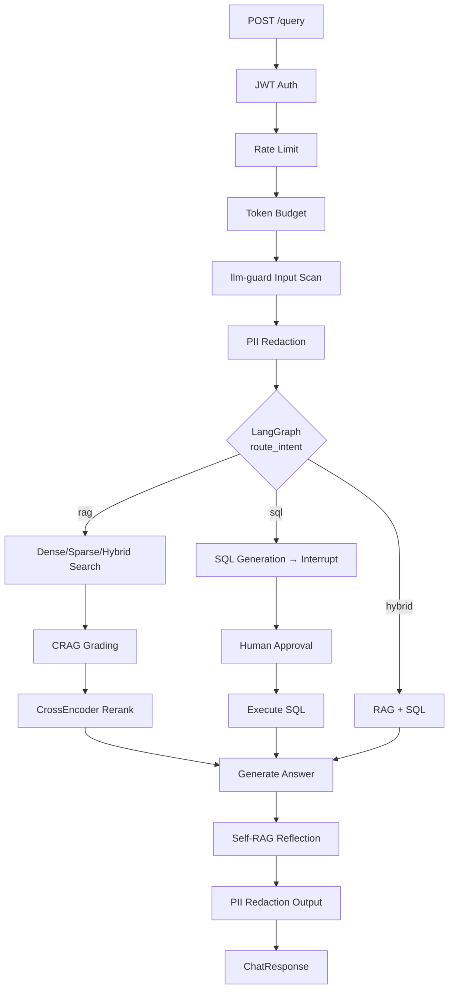

<div align="center">

# VectraIQ

**Production-grade AI Knowledge Platform for Kubernetes IT Operations**

[](https://github.com/hardik-gupta/vectraiq/actions/workflows/ci.yml)
[](LICENSE)
[](https://www.python.org/)
[](https://fastapi.tiangolo.com/)
[](https://nextjs.org/)
[](docker-compose.yml)

*Ask questions about your Kubernetes cluster in plain English. Get accurate, cited answers in seconds.*

</div>

---

VectraIQ is an enterprise AI copilot that answers Kubernetes operations questions using **Hybrid RAG** (dense + sparse + reranking), **Text2SQL** with human-in-the-loop approval, and a multi-tier caching system — all behind a hardened 10-layer security pipeline and a modern Next.js SaaS frontend.

## Features

| Capability | Details |
|---|---|
| **Hybrid RAG** | Dense (Qdrant) + Sparse (TF-IDF) search fused with RRF, CrossEncoder reranking |
| **HyDE** | Hypothetical Document Embeddings for improved recall on vague queries |
| **CRAG** | Relevance grading with automatic Tavily web-search fallback |
| **Self-RAG** | Answer quality reflection loop with configurable retry threshold |
| **Text2SQL** | LLM-generated SQL with human-in-the-loop approval before execution |
| **Streaming** | Server-Sent Events endpoint for progressive UI updates |
| **Multi-tier Cache** | 5-tier Redis + in-memory cache (embeddings, answers, SQL, intent) |
| **10-layer Security** | Injection detection, JWT, rate limiting, budget, llm-guard, PII redaction, spotlighting |
| **Observability** | Langfuse tracing (optional), structured JSON logging, OpenTelemetry hooks |

## Architecture

```
┌─────────────────────────────────────────────────────────────────┐
│                     Next.js 15 Frontend                         │
│           (Dashboard · Chat · Knowledge · Analytics)            │
└─────────────────────┬───────────────────────────────────────────┘
                      │  HTTPS + SSE (text/event-stream)
┌─────────────────────▼───────────────────────────────────────────┐
│                   FastAPI Backend (vectraiq/)                    │
│  JWT Auth → Rate Limit → Token Budget → Input Guard             │
│                           │                                     │
│            ┌──────────────▼──────────────┐                     │
│            │      LangGraph State Machine │                     │
│            │  route_intent ──┬── [rag]   │                     │
│            │                 ├── [sql]   │                     │
│            │                 └── [hybrid]│                     │
│            └──────────────┬──────────────┘                     │
│                           │                                     │
│        ┌──────────────────┼──────────────────────┐             │
│        │                  │                       │             │
│   Qdrant             PostgreSQL 16           Upstash Redis      │
│  (Vectors)         (Users · SQL)             (5-tier cache)     │
└─────────────────────────────────────────────────────────────────┘
```



## Quick Start

### Prerequisites

- Docker + Docker Compose
- OpenAI API key

### 1. Clone and configure

```bash
git clone https://github.com/hardik-gupta/vectraiq.git
cd vectraiq
cp .env.example .env
```

Edit `.env`:
```env
OPENAI_API_KEY=sk-...
JWT_SECRET=<at-least-32-random-characters>
```

### 2. Start all services

```bash
docker compose up
```

This starts PostgreSQL 16 (`:5432`), Qdrant (`:6333`), and the VectraIQ API (`:8000`).

### 3. Seed the database

```bash
docker compose exec app python scripts/seed_db.py
```

### 4. Start the frontend

```bash
cd frontend
npm install
cp .env.local.example .env.local
npm run dev
```

Open [http://localhost:3000](http://localhost:3000).

### Default credentials (after seeding)

| Username | Password | Role |
|---|---|---|
| `admin` | `admin123` | Admin |
| `user` | `user123` | User |

## Local Development (without Docker)

```bash
# Backend
make install   # creates .venv + installs all deps via uv
make api       # FastAPI at :8000

# Frontend
cd frontend && npm install && npm run dev
```

## Environment Variables

| Variable | Required | Description |
|---|---|---|
| `OPENAI_API_KEY` | ✅ | OpenAI API key |
| `JWT_SECRET` | ✅ | Token signing secret (min 32 chars) |
| `DATABASE_URL` | ✅ | PostgreSQL connection string |
| `QDRANT_URL` | ✅ | Qdrant server URL |
| `FRONTEND_ORIGINS` | — | Allowed CORS origins (default: `http://localhost:3000`) |
| `UPSTASH_REDIS_URL` | — | Upstash Redis URL (in-memory fallback if absent) |
| `UPSTASH_REDIS_TOKEN` | — | Upstash Redis token |
| `TAVILY_API_KEY` | — | Tavily search (CRAG web fallback) |
| `LANGFUSE_SECRET_KEY` | — | Langfuse tracing (disabled if absent) |
| `LANGFUSE_PUBLIC_KEY` | — | Langfuse public key |
| `LOG_JSON` | — | `true` for structured JSON logs in production |

Full list: [`.env.example`](.env.example)

## API Reference

Base URL: `http://localhost:8000`  
Interactive docs: [http://localhost:8000/docs](http://localhost:8000/docs)

| Method | Path | Auth | Description |
|---|---|---|---|
| `POST` | `/auth/register` | — | Register a new user |
| `POST` | `/auth/login` | — | Get a JWT bearer token |
| `POST` | `/query` | JWT | Ask a question (blocking) |
| `POST` | `/query/stream` | JWT | Ask a question (SSE streaming) |
| `POST` | `/query/sql/execute` | JWT | Approve/reject a pending SQL query |
| `GET` | `/admin/health` | — | System health check (200 OK / 503 Degraded) |
| `GET` | `/admin/cache/stats` | JWT+Admin | Cache hit/miss statistics |
| `POST` | `/admin/cache/clear` | JWT+Admin | Clear in-memory cache |

## Testing

```bash
make test                              # all tests (no external services needed)
pytest tests/ -v --cov=vectraiq       # with coverage report
pytest tests/test_auth.py -v          # auth only
```

## Project Structure

```
vectraiq/           Python package (FastAPI backend)
  api/              Routers: auth, query, admin
  ai/               RAG pipeline: embedding, vector_store, reranking, CRAG, HyDE, Self-RAG
  core/             LangGraph state machine (graph.py, state.py)
  middleware/       JWT auth, rate limiter, request context, security headers
  security/         10-layer security pipeline
  cache/            5-tier query cache
frontend/           Next.js 15 SaaS UI
tests/              pytest test suite (mocked, no external deps)
eval/               RAGAS evaluation harness (40 golden questions)
scripts/            DB migration + document ingestion
seed/               K8s documentation corpus
```

## Deployment

**Recommended:** Frontend on [Vercel](https://vercel.com), backend on [Railway](https://railway.app).

Set `NEXT_PUBLIC_API_URL=https://your-api.railway.app` on Vercel and all backend env vars on Railway.

See [DEPLOYMENT_GUIDE.md](DEPLOYMENT_GUIDE.md) for step-by-step instructions.

## Evaluation

```bash
make eval-baseline   # naive dense-only profile
make eval-all        # all features enabled
make eval            # baseline + all + diff report
```

Results in `eval/results/`. 40 golden K8s Q&A pairs covering pods, deployments, services, ingress, RBAC.

## Roadmap

- [ ] `/documents/upload` backend endpoint (parsing + chunking + upsert pipeline)
- [ ] User-scoped SQL approval threads (security hardening)
- [ ] Prometheus `/metrics` endpoint
- [ ] Slack / Teams integration bot
- [ ] Multi-tenant workspace support

## Contributing

See [CONTRIBUTING.md](CONTRIBUTING.md). Bug reports and PRs are welcome.

## Security

See [SECURITY.md](SECURITY.md) for the vulnerability reporting policy and full security architecture.

## License

[MIT](LICENSE) © 2026 Hardik Gupta
